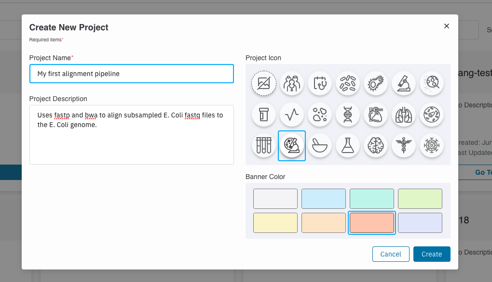

Tutorials  
=====================

For this tutorial we will be creating a simple alignment pipeline using `fastp <https://github.com/OpenGene/fastp>`_ 
and `bwa <http://bio-bwa.sourceforge.net/bwa.shtml>`_. 

.. image:: _images/simple_alignment_pipeline.png 
    :alt: Simple alignment pipeline

Create Project
----------------

On the top right corner of your Project's page, hit ``Create Project`` and enter the corresponding information. 

::

    Project Name: My first alignment pipeline

    Project Description: Uses fastp and bwa to align subsampled E. Coli fastq files to the E. Coli genome.

Click ``Create`` and naviagate to the ``View Details`` page of your project. 

