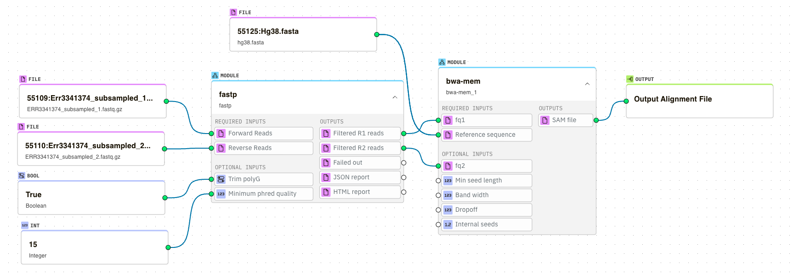

Tutorials  
=====================

.. _installation:

Overview
------------

For this tutorial we will be creating a simple alignment pipeline using `fastp <https://github.com/OpenGene/fastp>`_ 
and `bwa <http://bio-bwa.sourceforge.net/bwa.shtml>`_. 

Create Project
----------------

To retrieve a list of random ingredients,
you can use the ``lumache.get_random_ingredients()`` function:

.. autofunction:: lumache.get_random_ingredients

The ``kind`` parameter should be either ``"meat"``, ``"fish"``,
or ``"veggies"``. Otherwise, :py:func:`lumache.get_random_ingredients`
will raise an exception.

.. autoexception:: lumache.InvalidKindError

For example:

>>> import lumache
>>> lumache.get_random_ingredients()
['shells', 'gorgonzola', 'parsley']
